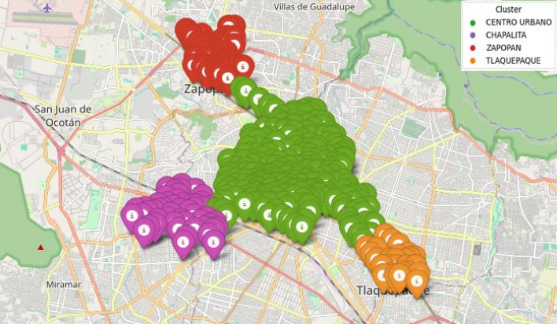
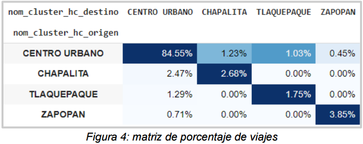
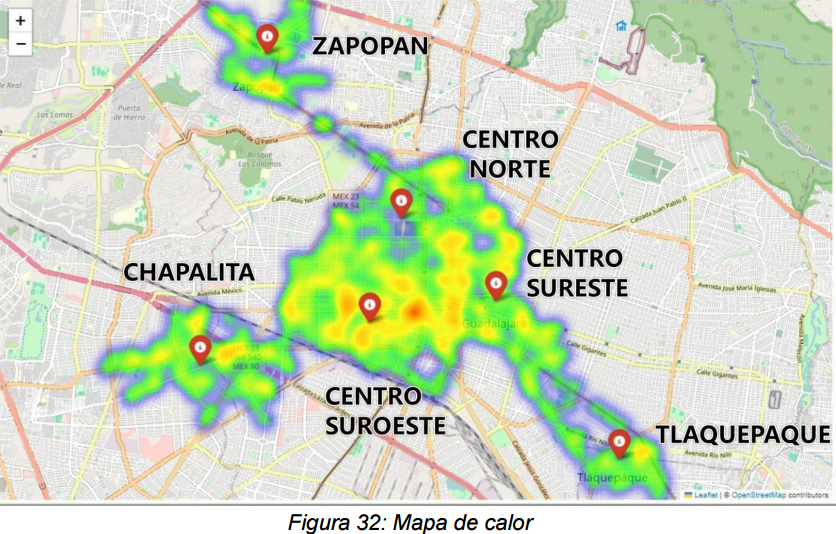

# TFM-Distribucion-ruta-bici

## Resumen del Proyecto
🎯 Objetivo: Analizar los patrones de uso del sistema MiBici para identificar oportunidades de optimización del servicio.

🔑 Hallazgo Clave: El Centro Urbano es el principal núcleo de movilidad, concentrando más del 80% de los viajes, lo que evidencia la necesidad de priorizar la redistribución de bicicletas en esa zona.

⚙️ Metodología: Se utilizó clusterización jerárquica con la métrica de distancia Haversine, ya que demostró ser más efectiva que otros métodos como K-means y DBSCAN para estos datos geoespaciales.

💡 Recomendación: Se propone una redistribución dinámica de bicicletas y la implementación de tarifas diferenciadas y promociones para equilibrar el uso del sistema en toda la ciudad.

## Mi Contribución
En este proyecto, mis responsabilidades principales fueron el trabajo técnico en la clusterización geoespacial y el enriquecimiento del dataset. Esto incluyó la experimentación y evaluación de diferentes algoritmos (K-Means, DBSCAN y Jerárquico) para encontrar el modelo más adecuado, así como el desarrollo del código principal para el análisis.

### Archivos Completos
* Para un análisis técnico detallado, puede explorar el **[Jupyter Notebook completo aquí](Análisis_Cluster_Centro.ipynb)**.
* Para el documento final del TFM, puede descargar el **[informe en PDF aquí](TFM_Análisis_del_sistema_de_bicicletas_públicas_MiBici_mediante_clusterización_geoespacial_Grupo_10.pdf)**.
